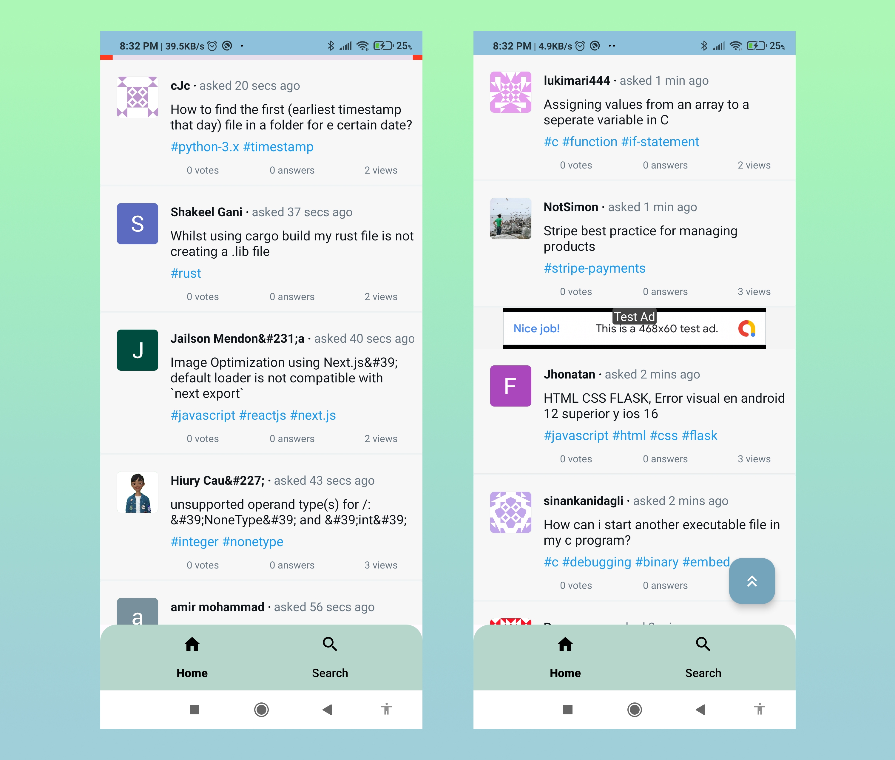
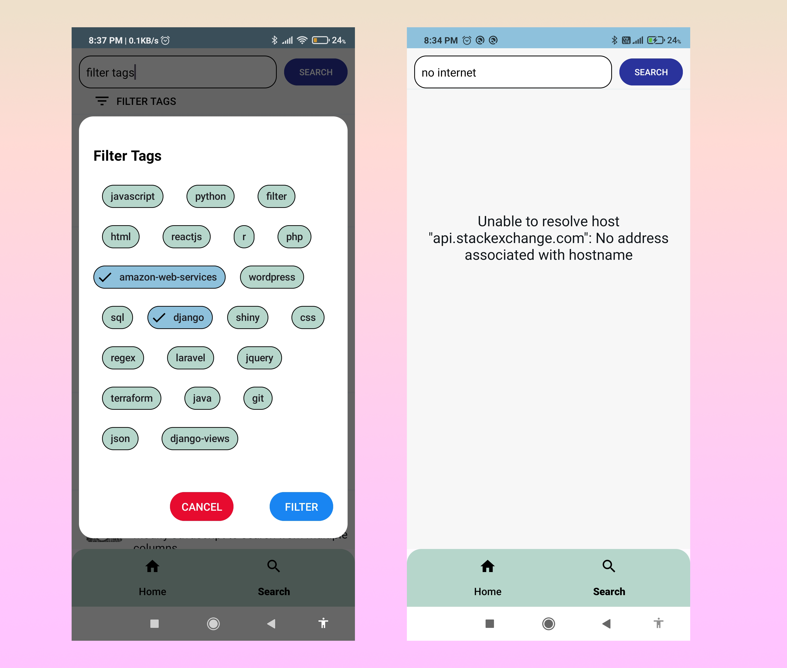

# StackBuzz 📱🚀
StackBuzz is an Android app built with Kotlin that allows users to browse and search trending questions on Stack Overflow. The app utilizes the StackExchange API to fetch questions and display them in a user-friendly interface. With offline compatibility, search functionality, and question filtering based on tags, StackBuzz is the perfect companion for developers seeking answers to their coding questions. 🌐💡

## Features 🌟
- <b>Home Screen:</b> Displays a list of trending questions with details such as owner's profile, tags, and formatted date. 📋
- <b>WebView:</b> Opens selected questions in a WebView for easy browsing. 🌐
- <b>Advertisements:</b> Displays an advertisement after every 5 questions in the list. 📢
- <b>Caching:</b> Caches responses on the home screen for offline compatibility. 💾
- <b>Search Functionality:</b> Allows users to search for specific questions. 🔍
- <b>Tags Filtering:</b> Filters questions based on one or more tags entered by the user. 🏷️

## Built With 🛠️
- <b>Kotlin:</b> The main programming language used to develop the app. 💻
- <b>MVVM Architecture:</b> A modern architectural pattern that separates the app's logic from its UI. 🏗️
- <b>Retrofit:</b> A type-safe HTTP client for Android and Java, used for making API calls. 📡
- <b>GSON:</b> A Java library used for converting Java Objects into JSON and vice-versa. 🔄
- <b>RoomDB:</b> A persistence library that provides an abstraction layer over SQLite, used for caching responses. 🗄️
- <b>LiveData:</b> An observable data holder class that is lifecycle-aware, used for updating the UI with data changes. 🔄
- <b>Glide:</b> An image loading and caching library for Android, used for displaying owner's profile images. 🖼️
- <b>Google Mobile Ads SDK:</b> A library for integrating Google AdMob ads into the app. 💰

## 📷 Previews

  
  
  

## Getting Started 🚀
To get started with StackBuzz, clone the repository and open the project in Android Studio. Make sure you have an internet connection to fetch the latest questions from the StackExchange API.

## Contributing 🤝
Feel free to contribute to this project by submitting issues, pull requests, or providing valuable feedback. Your contributions are always welcome! 🙌

# License 📄
StackBuzz is released under the [MIT License](https://opensource.org/licenses/MIT). Feel free to modify or add to this list based on the specific features of your app. 📝

## Acknowledgments 🙏
[StackExchange API documentation:](https://api.stackexchange.com/docs)

## Happy coding! 🎉👩‍💻👨‍💻
